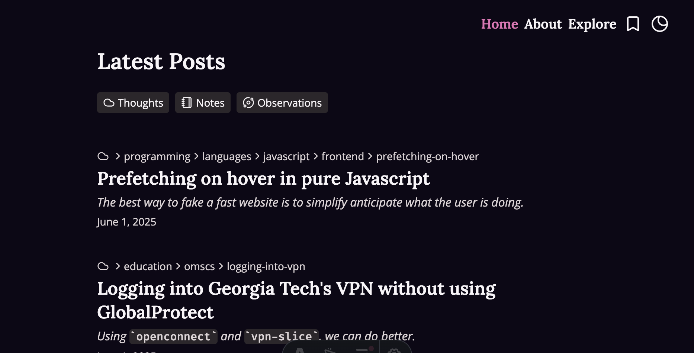
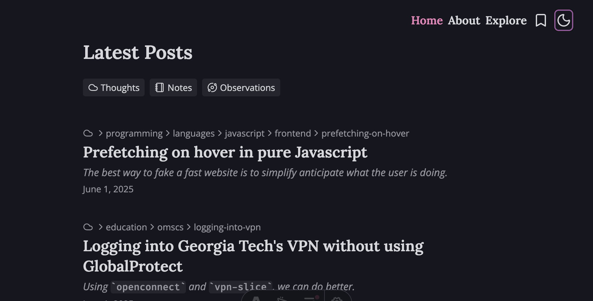

I'm aesthetically challenged. Take a look at the [git history](https://github.com/abhiaagarwal/abhiaagarwal/commits/main/src/global.css) of the `global.css` file to watch my desperate attempts to tweak every color. While I _think_ I nailed the light mode theme, the dark mode leaves much to desired.

I'm someone who dual wields light and dark mode with the diurnal cycle, much to the chagrin and disgust of my colleagues. The light mode CSS was designed to mimic a minimalist old-timey newspaper, with splashes of pink and lavender providing a pop of a *je ne sais quoi*. I "created" the dark mode CSS by simply swapping the order of my light mode CSS, and then manually tweaking by using inspect element by sliding around the color wheel. Despite literal hours of tweaking, I could never get a tasteful dark mode.

I recently learned Cursor gained to the ability to give the coding agent a [browser](https://cursor.com/docs/agent/browser). I regularly use AI coding agents in the same way as code-monkey juniors, letting them produce what I consider to be mediocre code much faster than my hands physically can, and then manually cleaning it up and injecting *taste* into the slop. However, Anthropic's recent Claude Opus 4.5 has changed this; having not been a fan of any releases since Claude Sonnet 3.5, Opus 4.5 actually *has* that taste.

So, primed with Opus 4.5 and Cursor Browser Agent, I simply prompted the agent:

> Can you figure out a better dark theme for my blog? 
> The light theme looks fine, but I dislike the dark theme's contrast.

The agent reasoned, using the browser as a tool and constantly taking screenshots, operating parts of my website with ease (likely made possible due to my investment in ARIA-compliant accessibility). After 63 seconds, it spit out an entirely new dark theme.

For the first time in my life, I fear the existence of my job.
